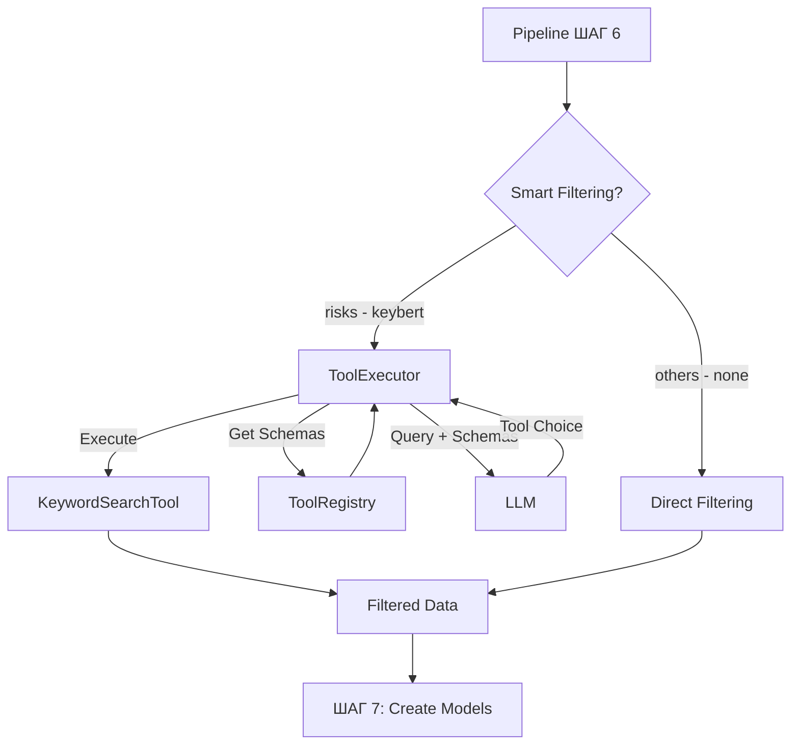

# Architecture Quick Reference

## Слои архитектуры

### 1. API Layer (Presentation)
- `endpoints.py` - обработка HTTP запросов
- `schemas.py` - валидация входных/выходных данных

### 2. Pipeline Layer (Application)
- Оркестрация бизнес-процессов
- Координация сервисов
- Обработка исключений
- Блочное логирование с уникальными Pipeline ID

### 3. Service Layer (Business Logic)
- **Normalization** - очистка данных
- **Classifier** - классификация через LLM с динамическими Literal типами (используют единую конфигурацию)
- **AnswerGenerator** - генерация ответов

### 4. Domain Layer (Core)
- Доменные модели (Contractor, Risk, Error, Process)
- Бизнес-правила
- Перечисления (enums)

### 5. Adapter Layer (Infrastructure)
- `excel_loader.py` - работа с Excel файлами
- `llm_client.py` - интеграция с LLM

## Единая конфигурация классификации

### ClassificationConfig
Центральная конфигурация для управления логикой классификации всех типов сущностей:

```python
# Структура конфигурации
class ClassificationConfig:
    CONTRACTOR = {
        "column_name": "work_types",    # Колонка для классификации
        "item_type": "вид работ",       # Тип для LLM промптов
        "description": "..."            # Описание
    }
    
    RISK = {"column_name": "project_name", "item_type": "проект", ...}
    ERROR = {"column_name": "project_name", "item_type": "проект", ...}  
    PROCESS = {"column_name": "process_name", "item_type": "процесс", ...}

# Использование в классификаторах
classifier = RiskClassifierService(llm_client)
# Автоматически использует RISK.column_name = "project_name"
# Автоматически использует RISK.item_type = "проект"

# Изменение конфигурации
ClassificationConfig.RISK["column_name"] = "risk_category"
ClassificationConfig.RISK["item_type"] = "категория риска"
```

### Принцип работы
1. Базовый классификатор получает `entity_type` в конструкторе
2. Загружает соответствующую конфигурацию из `ClassificationConfig`  
3. Использует `column_name` для извлечения уникальных значений
4. Использует `item_type` в промптах для LLM
5. Поддерживает fallback методы для совместимости

## Dependency Injection

```python
# Регистрация в контейнере
container.register_factory(
    ContractorClassifierService,
    lambda: ContractorClassifierService(container.get(LLMClient))
)

# Получение из контейнера
classifier = container.get(ContractorClassifierService)
```

## Паттерны

### 1. Factory Pattern
```python
# Создание пайплайнов
def get_pipeline(button_type: ButtonType) -> Pipeline:
    factories = {
        ButtonType.CONTRACTORS: create_contractors_pipeline,
        ButtonType.RISKS: create_risks_pipeline,
        # ...
    }
    return factories[button_type]()
```

### 2. Template Method Pattern
```python
# Базовый пайплайн с шаблонным методом (8 шагов)
class BasePipeline:
    def process(self, question: str) -> Answer:
        # 1. Загрузка данных
        df = self.excel_loader.load()
        # 2. Нормализация
        cleaned_df = self.normalization_service.clean_df(df)
        # 3. Предварительная обработка
        processed_df = self._pre_process_dataframe(cleaned_df)
        # 4. Загрузка элементов для классификации
        self._load_classifier_items(processed_df)
        # 5. Классификация (с динамическими Literal типами)
        best_item = self.classifier_service.classify(question)
        # 6. Интеллектуальная фильтрация (условная логика)
        filtered_df = self._smart_filter_data(processed_df, best_item, question)
        # 7. Преобразование в модели
        items = self._dataframe_to_models(filtered_df)
        # 8. Генерация ответа
        return self._generate_answer(question, items)
```

### 3. Strategy Pattern
```python
# Разные стратегии обработки для разных типов данных
BUTTON_PROCESSORS = {
    ButtonType.CONTRACTORS: process_contractors,
    ButtonType.RISKS: process_risks,
    # ...
}
```

### 4. Dynamic Model Creation
```python
# Динамическое создание Pydantic моделей с Literal типами
def _create_dynamic_classification_model(self, items: List[str]):
    literal_type = Literal[tuple(items)]
    MatchResult = create_model(
        'MatchResult',
        item=(literal_type, Field(..., description="Элемент из списка")),
        score=(float, Field(..., ge=0, le=1))
    )
    return create_model(
        'ClassificationResult',
        reasoning=(str, Field(...)),
        top_matches=(List[MatchResult], Field(..., max_items=3))
    )
```

## Поток данных

**Request** → `API Endpoint` → выбор `Pipeline` по типу кнопки → **Pipeline process (8 шагов)**:

1. **[ШАГ 1]** → `ExcelLoader` загружает данные
2. **[ШАГ 2]** → `NormalizationService` очищает
3. **[ШАГ 3]** → Предварительная обработка (фильтрация по категории)
4. **[ШАГ 4]** → Загрузка элементов для классификации (например, проектов)
5. **[ШАГ 5]** → `ClassifierService` + `LLM` (определение проекта)
6. **[ШАГ 6]** → Интеллектуальная фильтрация:
   - **Риски**: `ToolExecutor` + `LLM` (глубокая фильтрация по смыслу)
   - **Остальные**: обычная фильтрация по результату классификации
7. **[ШАГ 7]** → Преобразование в доменные модели
8. **[ШАГ 8]** → `AnswerGenerator` + `LLM`

→ **Response** возврат клиенту

## Архитектура инструментов (Tools)

Для реализации сложной логики фильтрации (например, поиска рисков по смыслу, а не по точному совпадению) используется архитектура динамически вызываемых инструментов.

### Компоненты
- **`BaseTool`**: Абстрактный класс, требующий от всех инструментов реализации двух методов:
  - `get_schema()`: Возвращает JSON-схему, описывающую параметры инструмента для LLM.
  - `execute()`: Выполняет основную логику инструмента.
- **`ToolRegistry`**: Сканирует директорию `app/tools` и автоматически регистрирует все классы, унаследованные от `BaseTool`. Это позволяет добавлять новые инструменты без изменения основного кода.
- **`ToolExecutor`**: 
  1. Получает от `ToolRegistry` схемы всех доступных инструментов.
  2. Отправляет их вместе с запросом пользователя в LLM.
  3. LLM решает, какой инструмент лучше всего подходит для задачи, и возвращает его имя и аргументы (например, `{"name": "search_by_keywords", "arguments": {"keywords": ["данные", "оборудование"]}}`).
  4. `ToolExecutor` находит нужный инструмент в `ToolRegistry` и вызывает его метод `execute` с полученными аргументами.
- **`KeywordSearchTool`**: Конкретная реализация `BaseTool`. Использует `pymorphy3` для лемматизации, что позволяет находить слова в разных формах (например, "данные", "данных", "данным").

### Поток работы с инструментами




## Конфигурация

### Иерархия настроек
```
BaseAppSettings
├── AppSettings (основные + DEBUG)
├── ContractorSettings
├── RiskSettings  
├── ErrorSettings
├── ProcessSettings
├── LLMSettings
└── SmartFilteringSettings (стратегии фильтрации)
```

### SmartFilteringSettings
```python
class SmartFilteringSettings:
    # Стратегия для каждого типа пайплайна
    strategy: Dict[str, str] = {
        "contractors": "none",      # Без дополнительной фильтрации
        "risks": "keybert",         # Интеллектуальный поиск по ключевым словам
        "errors": "none",           # Без дополнительной фильтрации
        "processes": "none",        # Без дополнительной фильтрации
    }
    
    # Какая стратегия использует какой инструмент
    strategy_tool_map: Dict[str, str] = {
        "keybert": "search_by_keywords",
    }
```

### Префиксы переменных окружения
- `APP_` - основные настройки
- `LLM_` - настройки LLM (общие)
- `CONTRACTOR_` - настройки подрядчиков
- `RISK_` - настройки рисков
- `ERROR_` - настройки ошибок
- `PROCESS_` - настройки процессов

## Логирование

### Блочная система логирования
```python
# PipelineLogger для блочного логирования
from app.utils.logging import get_pipeline_logger
pipeline_logger = get_pipeline_logger(__name__)

# Начало блока пайплайна
pipeline_id = pipeline_logger.start_pipeline_block("contractors", "вопрос")

# Логирование шагов
pipeline_logger.log_step_ok(1, "Загрузка данных", "детали")
pipeline_logger.log_detail("Детальная информация")
pipeline_logger.log_prompt_details("classification", system, user, response)

# Завершение блока
pipeline_logger.end_pipeline_block(success=True)
```

### Структура логов
```
================================================================================
[БЛОК НАЧАЛО] Pipeline ID: a1b2c3d4 | Режим: DEBUG
[ЗАПРОС] Кнопка: contractors | Вопрос: 'найти подрядчиков'
================================================================================
[ШАГ 1 ОК] Загрузка данных: Файл загружен (123 строк)
[a1b2c3d4] Детальная информация...
[ШАГ 2 ОК] Нормализация данных
[ШАГ 3 ОК] Предварительная обработка
[ШАГ 4 ОК] Загрузка элементов
[ШАГ 5 ОК] Классификация: Выбран элемент 'X'
[ШАГ 6 ОК] Фильтрация данных
[ШАГ 7 ОК] Преобразование в модели
[ШАГ 8 ОК] Генерация ответа
[БЛОК КОНЕЦ] Pipeline ID: a1b2c3d4 | Успешно завершен за 2.3с
================================================================================
```

### Режимы логирования
- **DEBUG** (`DEBUG=true`): полная детализация + промпты LLM
- **PROD** (`DEBUG=false`): только статусы шагов
- **Единый файл**: `LOGS/dup_ai.log`

## Классификация с Literal типами

### Проблема и решение
**Проблема**: LLM могла ошибаться в названиях элементов при классификации
**Решение**: Динамическое создание Pydantic моделей с Literal типами

```python
# Старый подход (могли быть опечатки)
top_items: Dict[str, float] = {
    "Проект Альфа": 0.9,     # ✅ правильно
    "проект бета": 0.6,      # ❌ неправильный регистр  
    "Проект Гама": 0.3       # ❌ опечатка в "Гамма"
}

# Новый подход (точный выбор)
top_matches: List[MatchResult] = [
    MatchResult(item="Проект Альфа", score=0.9),    # ✅ только из списка
    MatchResult(item="Проект Бета", score=0.6),     # ✅ точное название
    MatchResult(item="Проект Гамма", score=0.3)     # ✅ без опечаток
]
```

## Добавление нового типа данных

1. **Модель** → `app/domain/models/new_type.py`
2. **Enum** → добавить в `ButtonType`
3. **Сервисы**:
   - `new_type_normalization.py` (наследует BaseNormalizationService)
   - `new_type_classifier.py` (наследует BaseClassifierService)
   - `new_type_answer_generator.py` (наследует BaseAnswerGeneratorService)
4. **Pipeline** → `new_type_pipeline.py` (наследует BasePipeline)
5. **Регистрация** → в `pipelines/__init__.py`
6. **Конфигурация** → в `config.py` и `.env`

## Обработка ошибок

```python
try:
    # Основная логика
    result = pipeline.process(question)
except Exception as e:
    pipeline_logger.log_step_error(step_num, "Название шага", str(e))
    pipeline_logger.end_pipeline_block(success=False, error_msg=str(e))
    return Answer(
        text=f"Ошибка: {str(e)}",
        query=question,
        total_found=0,
        items=[]
    )
```

## Советы по отладке

1. **Включить DEBUG режим**:
   ```env
   DEBUG=true
   ```

2. **Отследить конкретный пайплайн**:
   ```bash
   grep "a1b2c3d4" LOGS/dup_ai.log  # по Pipeline ID
   ```

3. **Посмотреть только шаги пайплайна**:
   ```bash
   grep "\[ШАГ" LOGS/dup_ai.log
   ```

4. **Посмотреть промпты LLM**:
   ```bash
   grep -A 10 "SYSTEM PROMPT" LOGS/dup_ai.log
   ```

5. **Проверить LLM**:
   ```bash
   curl http://localhost:11434/api/tags
   ```

6. **Мониторинг логов в реальном времени**:
   ```bash
   tail -f LOGS/dup_ai.log
   ```

7. **Тестовый запрос**:
   ```bash
   curl http://localhost:8080/v1/health
   ```

8. **Поиск ошибок**:
   ```bash
   grep "ОШИБКА\|ERROR" LOGS/dup_ai.log
   ```